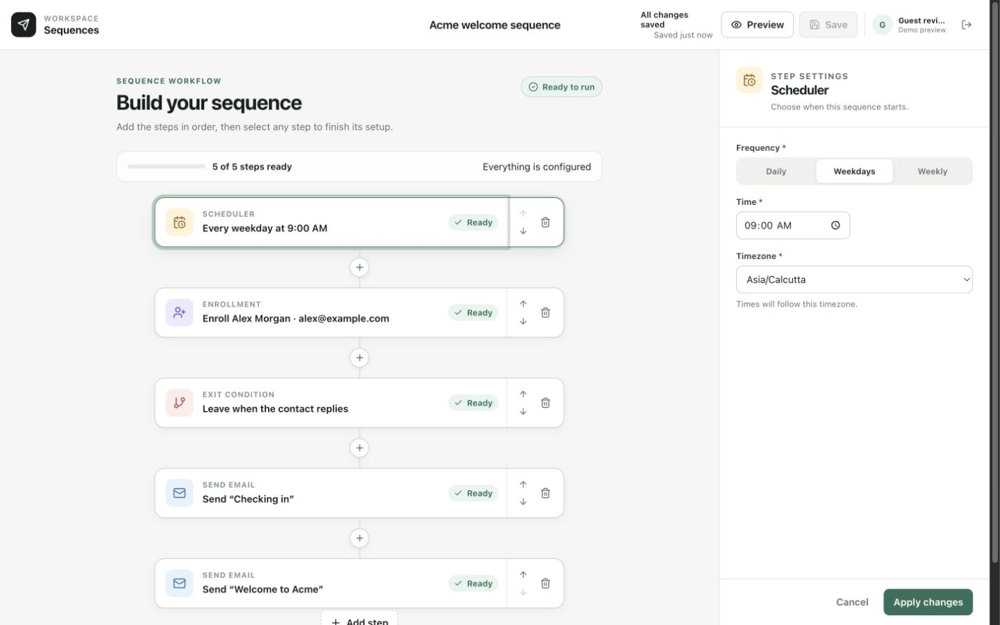
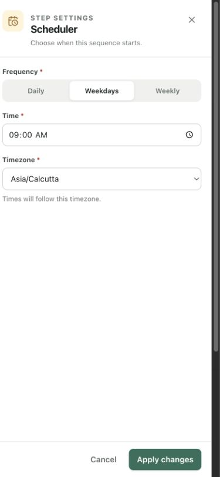

# Workflow Sequence Builder

A focused React prototype for composing a small customer email sequence. A user can add and order steps, configure each step in a side editor, review readiness, preview the resulting sequence in plain language, and save the draft in the browser.

The source is JavaScript and JSX. There is no TypeScript or backend in this submission.

**Live demo:** [dakshyadavdtu.github.io/araliproj](https://dakshyadavdtu.github.io/araliproj/)

## Screenshots



*Desktop: the ordered workflow remains visible while the selected scheduler is edited in the right-hand inspector.*



*Mobile: step settings move into a full-width panel with persistent Cancel and Apply actions.*

## Features

- Four purpose-built step types: Scheduler, Enrollment, Exit condition, and Send email.
- Insert controls between steps and at the end of the sequence.
- Button-based reordering and confirmed deletion.
- One Scheduler, Enrollment, and Exit step per sequence, with up to two Email steps.
- Step-specific forms, inline validation, readiness status, and an overall progress summary.
- Local editor drafts: changes affect the workflow only after **Apply changes**.
- A discard warning when moving to another step while edits are unapplied.
- A plain-language preview built from the current workflow data.
- An example sequence for a fast reviewer walkthrough.
- Explicit browser save, dirty-state feedback, `Ctrl/Cmd + S`, and an unsaved-change warning on page exit.
- Schema-versioned `localStorage` persistence with defensive parsing.
- Responsive desktop, tablet, and mobile layouts, including a mobile slide-over editor.
- Keyboard-visible focus styles, semantic form labels, accessible button names, dialog roles, status announcements, Escape handling, and reduced-motion support.
- Google Identity Services sign-in when configured, plus clearly identified guest preview access when it is not.

This prototype configures and previews a sequence; it does not schedule or send real email.

## Stack

- React 19 and React DOM
- Vite 8
- Redux Toolkit and React Redux
- JavaScript and JSX
- Lucide React icons
- Vitest, jsdom, Testing Library, and `user-event`
- Oxlint
- Plain CSS with responsive media queries

## Run locally

Requirements: Node.js `^20.19.0` or `>=22.12.0` and npm. These are the versions supported by the installed Vite release.

```bash
git clone https://github.com/dakshyadavdtu/araliproj.git
cd araliproj
npm ci
npm run dev
```

Open the local URL printed by Vite. Google configuration is optional for assignment review: if `VITE_GOOGLE_CLIENT_ID` is absent, the entry screen offers **Preview the demo**.

Useful commands:

```bash
npm run dev        # start the development server
npm run build      # create the production bundle in dist/
npm run preview    # serve the production bundle locally
npm test           # run the test suite once
npm run test:watch # run tests in watch mode
npm run lint       # lint src/ and vite.config.js
```

## Google Identity setup

The app dynamically loads the official Google Identity Services client and asks it to render the Google button. To enable it locally:

1. In Google Cloud, create or select an OAuth 2.0 client with application type **Web application**.
2. Configure the consent screen and add the exact browser origins you will use under **Authorized JavaScript origins**. For the default Vite server, add both `http://localhost` and `http://localhost:5173`. Add the exact production origin separately when deploying.
3. Create a local environment file:

   ```bash
   cp .env.example .env.local
   ```

4. Replace the example value with the Web client ID:

   ```dotenv
   VITE_GOOGLE_CLIENT_ID=1234567890-example.apps.googleusercontent.com
   ```

5. Restart the Vite server after changing the environment file.

The client ID is public configuration; do not add an OAuth client secret to a Vite environment variable. The `.env.local` file is ignored by Git.

When no client ID is configured, **Preview the demo** opens the editor as a guest. It is a review route, not a simulated Google sign-in. When Google is configured, the browser callback decodes only basic profile fields for display, stores the sanitized profile in `sessionStorage`, and never persists the credential. Sign-out clears that profile and disables Google auto-selection.

Client-side decoding is not authentication for a production system. A real application must send the ID token to a trusted backend and verify its signature, audience, issuer, and expiry before creating an application session. See the [Google Identity Services setup guide](https://developers.google.com/identity/gsi/web/guides/get-google-api-clientid) and [server-side ID-token verification guide](https://developers.google.com/identity/gsi/web/guides/verify-google-id-token).

## Suggested review flow

1. Open the live demo, or run the app without a Google client ID and choose **Preview the demo**.
2. From the empty builder, add a Scheduler and apply its frequency, time, and timezone.
3. Add Enrollment and enter a contact name and valid email address.
4. Add an Exit condition, then add Send email and apply it with the subject or body empty. The card remains **Needs attention** and the editor explains what is missing.
5. Complete the email fields and apply again. The sequence becomes ready once every required step is valid.
6. Use a plus control to inspect the disabled limits, reorder a step with its arrows, and open then cancel the delete confirmation.
7. Rename the sequence and open **Preview** to review the generated narrative.
8. Save with the button or `Ctrl/Cmd + S`, reload the page, and confirm that the saved sequence is restored.

For a shorter tour, **Load example** creates a complete five-step sequence with two emails; it is optional and the editor does not depend on it.

## Structure and architecture

The application deliberately keeps a flat `src/` structure because the feature set is small:

```text
src/
├── main.jsx          React root and Redux Provider
├── App.jsx           authentication-to-builder boundary
├── AuthGate.jsx      Google Identity Services and guest entry
├── Builder.jsx       page orchestration, commands, and transient UI state
├── Workflow.jsx      ordered workflow, cards, and add controls
├── Editor.jsx        local step drafts and type-specific fields
├── Dialogs.jsx       preview, deletion, and discard dialogs
├── store.js          Redux slice, actions, selectors, and store factory
├── workflow.js       data model, rules, validation, summaries, and persistence
├── workflow.test.js  domain, reducer, persistence, and interaction tests
└── styles.css        visual system and responsive behavior
```

`workflow.js` contains framework-independent domain behavior. `store.js` owns committed application state. Components dispatch intent through Redux, while short-lived interface state—open dialogs, the add menu, toast text, and the current editor draft—stays close to the component that uses it.

### Ordered data model

A sequence is an object with stable identity and an ordered `nodes` array:

```js
{
  id,
  name,
  createdAt,
  updatedAt,
  nodes: [
    { id, type: 'scheduler', config: { frequency, time, weekday, timezone } },
    { id, type: 'enrollment', config: { contactName, email } },
    { id, type: 'exit', config: { condition, days } },
    { id, type: 'email', config: { recipient, subject, body } },
  ],
}
```

Array position is the displayed sequence order. This MVP does not model graph edges or branches. Node IDs are unique; limits are enforced both when options are presented and again in the Redux reducer. Readiness requires at least one valid Scheduler, Enrollment, Exit, and Email node.

### Drafts and validation

The selected node is copied into local editor state. Typing updates that copy, not Redux. **Apply changes** validates the draft and dispatches it only when valid; **Cancel** restores the committed node. Selecting or adding another step while a draft is dirty opens a discard confirmation.

Validation is split into two layers:

- Node validation covers required scheduler fields, a weekly weekday, contact name and email format, exit conditions and positive day counts, and email subject/body.
- Sequence validation checks required node types, node limits, duplicate IDs, per-node validity, and the readiness summary.

The same rules drive inline errors, card status, progress, and preview readiness, so those views do not maintain separate definitions of “complete.”

### Browser persistence

Saving writes a versioned record to `localStorage` under `arali.sequence-builder.v1`. The record contains `version`, `savedAt`, and the sequence snapshot. Loading rejects malformed JSON, unknown schema versions, unsupported node shapes, duplicate IDs, invalid dates, and node-limit violations; the app falls back to a new empty sequence instead of partially hydrating bad data.

Saving is explicit rather than automatic. Redux retains a cloned saved snapshot and derives dirty state by comparing the editable sequence with that snapshot. Google display profile data is separate and session-scoped in `sessionStorage`; no Google credential is stored.

## Production backend approach

The UI model is intentionally small, but it maps to a service architecture without treating the browser as an execution engine.

### Definitions and versions

- Store sequence metadata separately from immutable `sequence_versions`. Editing changes a draft; publishing validates it and creates a numbered snapshot in one transaction.
- Keep ordered node definitions on the version, either as validated JSON or normalized rows with an explicit `position`.
- Pin every enrollment to the published version it entered. Later edits create a new version and do not silently change contacts already in flight.
- Use optimistic concurrency (`version` or `updated_at`) on draft updates so one editor cannot unknowingly overwrite another.

### Enrollment and scheduling

- An `enrollments` row would reference the contact and sequence version and track `status`, `current_node`, `next_run_at`, exit reason, and timestamps.
- Enrollment is an explicit command with a caller-supplied idempotency key and a policy for whether a contact may enter once, repeatedly, or only after completing a prior run.
- A scheduler service computes timezone-aware run times and writes due work to a durable queue through a transactional outbox. Workers lease jobs rather than relying on browser timers or a single cron process.
- Before each action, a worker reloads enrollment state and checks exit conditions. This prevents an email queued earlier from sending after a reply or other exit event.

### Events and email delivery

- Normalize inbound events such as `contact.replied`, `email.opened`, and provider delivery callbacks. Deduplicate webhook events by the provider event ID and retain the raw payload for audit with an appropriate retention policy.
- Email execution renders a versioned template against an enrollment/contact snapshot, records an `email_delivery`, and sends through a provider adapter. Store the provider message ID to connect delivery, open, reply, bounce, and complaint events.
- Treat open events cautiously because privacy protections and image blocking make them weaker signals than replies or clicks.

### Idempotency, failures, and retries

- Give each logical node execution a stable unique key such as `(enrollment_id, sequence_version, node_id)`. Re-delivered queue messages must return the existing result instead of sending twice.
- Write state transitions and the next outbox job atomically. Use row locking or compare-and-swap updates so two workers cannot advance the same enrollment.
- Retry transient provider and network failures with bounded exponential backoff and jitter. Do not retry permanent failures such as invalid recipients without a change in data.
- After the retry limit, move work to a dead-letter state, expose the failure at enrollment and node level, alert operators, and allow an audited manual replay using the same idempotency boundary.

### API outline

```text
POST   /auth/google                         verify ID token; create application session
GET    /sequences                          list definitions
POST   /sequences                          create a draft
GET    /sequences/:id                      fetch draft and published metadata
PATCH  /sequences/:id/draft                update with optimistic version check
POST   /sequences/:id/publish              validate and create immutable version
POST   /sequences/:id/enrollments          enroll a contact idempotently
GET    /sequences/:id/enrollments          inspect active and completed runs
GET    /enrollments/:id                    inspect timeline and current state
POST   /enrollments/:id/cancel              exit an active run
POST   /webhooks/email-provider            ingest signed provider events
POST   /executions/:id/retry               replay an authorized failed execution
```

Mutating endpoints would require an authenticated application session, authorization by workspace, input validation against the node schema, audit logging, and rate limits. Webhooks would use provider signature verification rather than the browser session.

## Testing

The test suite uses Vitest with jsdom and Testing Library. The current 10 tests cover:

- required steps, node field rules, summaries, and the generated narrative;
- reducer enforcement of node limits, reordering, deletion selection, and dirty state;
- schema-versioned persistence and safe fallback for malformed or incompatible data;
- guest review entry, loading the example, and cancelling an editor draft without mutating the applied workflow.

Run it with `npm test`. The latest local run completed with 1 test file and all 10 tests passing. `npm run lint` checks the JavaScript/JSX source and Vite configuration. The highest-value next test layer would be browser-level coverage for Google callback handling, keyboard navigation, responsive dialogs, save/reload behavior, and accessibility checks.

## Tradeoffs and next steps

- An ordered list is clearer for this four-node assignment than an infinite graph canvas, but it cannot express branches or parallel work.
- Arrow controls are predictable and keyboard-accessible; drag-and-drop and undo/redo would improve longer workflows.
- The node catalog, one enrolled contact, plain-text email, and fixed limits keep configuration understandable but are not a general automation platform.
- Explicit local save makes persistence visible, but it has no cross-device sync, collaboration, revision history, or conflict handling.
- The scheduler and email nodes are configuration only. Production needs the versioned backend, event ingestion, durable queue, provider integration, observability, and retry model outlined above.
- The Google callback supports a review experience, not backend authorization. Production should exchange the ID token for an HTTP-only application session after server verification.
- Useful extensions include branching, delay nodes, reusable templates and variables, contact/segment selection, per-step execution history, import/export, end-to-end tests, and automated accessibility testing.

Product references and the decisions taken from them are documented in [RESEARCH.md](./RESEARCH.md).
